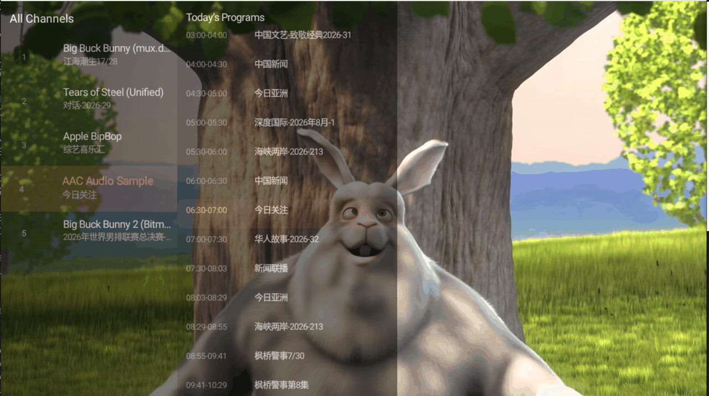
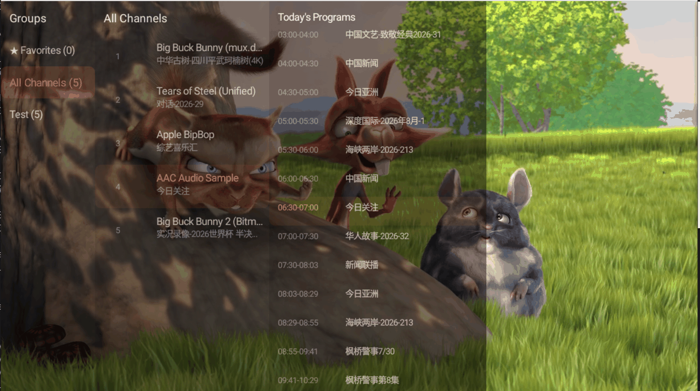
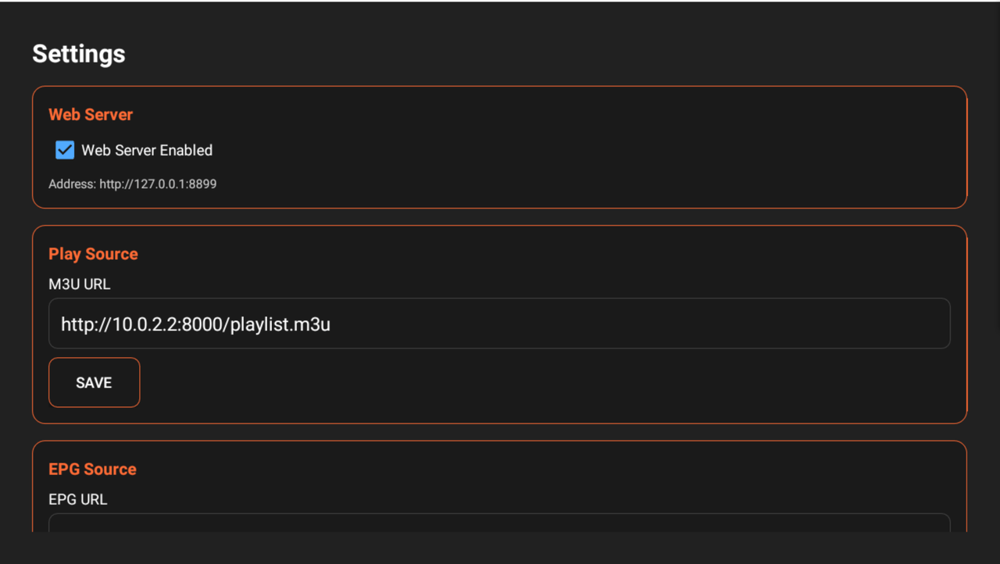

# 📺 LiteTV — 通用 IPTV 直播播放器

[](https://github.com/vibe4free/LiteTV/releases)
-4CAF50)


> GitHub 仓库：[github.com/vibe4free/LiteTV](https://github.com/vibe4free/LiteTV)

一款为 Android TV 遥控器深度优化的**通用 IPTV 直播播放器（空壳应用）**。自身不含任何直播源，配置你的 M3U 直播源地址后即可使用；支持 **EPG 电子节目单**、**频道分组与收藏**、**内置 Web 远程配置服务器**。

> 轻量设计：仅 ExoPlayer + HTTP，无 ijkplayer、无 P2P、无广告，APK 约 9 MB。

---

## ✨ 功能简介

### 核心定位
- **通用 IPTV 播放器（空壳）**：配置直播源后使用，支持 M3U / TXT 播放列表
- **支持 EPG 电子节目单**：XMLTV（含 gzip/zip 压缩）、DIYP JSON 多格式

### 🎮 遥控器专属交互
| 按键 | 功能 |
|------|------|
| D-Pad **UP / DOWN** | 切换频道（频道列表打开时导航列表） |
| D-Pad **LEFT / RIGHT** | 音量减 / 加 |
| **OK** | 显示 / 隐藏频道列表 |
| 数字键 **0-9** | 数字直达频道（2 秒输入窗口 + 顶部名称提示） |
| **MENU** | 打开设置界面 |
| **BACK** | 隐藏列表 / 取消数字输入 / 退出 |

### 📺 播放体验
- **无缝频道切换**：重用播放器实例（`switchUrl`），切换不重建连接，低延迟缓冲（1s/3s）
- **断流自动重连**：指数退避重试（1/2/4/8/15s），带播放状态提示与最终失败提示
- **多源 Failover**：一个频道多个地址（`url1#url2`）逐个尝试，失败自动切换
- **每频道自定义请求头**：支持 `http-user-agent`、`http-referrer`、`#EXTVLCOPT`、`url|User-Agent=...&Referer=...` 后缀
- **重启恢复**：自动续播上次观看的频道

### 🗂️ 频道管理
- M3U 解析：分组（`group-title`）、台标（`tvg-logo`）、频道 ID（`tvg-id`）、多源、UA/Referer
- **分组导航**：内置「我的收藏」「全部频道」+ 播放列表自带分组
- **收藏频道**：长按 OK 标记 / 取消（按频道名保存，刷新后依然有效）
- **播放列表磁盘缓存**：网络故障时自动使用缓存播放

### 📅 EPG 电子节目单
- **多格式支持**：XMLTV（gzip/zip 自动解压）、DIYP JSON，自动格式检测
- **高效解析**：流式解析（XmlPullParser）、单次批量解析全频道、302 重定向跟随
- **本地缓存**：磁盘缓存 + 按日期校验 + 版本控制，启动预加载秒开
- **节目展示**：当前节目 / 下一个节目、实时进度条、频道列表内嵌节目表
- **安全加固**：禁用外部实体解析（XXE 防护）

### 🌐 内置 Web 配置服务器（局域网远程配置）
- Socket HTTP 服务器，零外部依赖，默认端口 **8899**
- 浏览器打开 `http://电视IP:8899` 即可可视化配置
- REST 接口：`GET /config/get`、`POST /config/m3u-url`、`POST /config/epg-url`
- 安全加固：跨站请求防护（Origin 校验）、请求体上限、超时、有界线程池

### ⚙️ 设置项
- M3U 直播源地址、EPG 地址
- Web 服务器开关与端口
- 频道上下键交换（节目列表）、EPG 显示开关
- 菜单栏透明度（淡 / 中 / 实心）
- 配置通过 Hawk（加密）持久化

---

## 📸 截图

### 频道节目列表
频道列表（左侧）+ 节目单（右侧），高亮当前频道，节目单展示当前 / 下个节目与时间：



### 频道节目列表与频道分组
左侧分组栏（我的收藏 / 全部频道 / 各直播源分组），支持分组快速定位：



### 配置界面
M3U / EPG 地址配置与 Web 服务器信息（MENU 键打开）：



---

## 📦 安装下载

### 系统要求
- **Android TV / Google TV** 或支持 Leanback 的 Android 设备（**Android 5.1+，API 21+**）
- 内存建议 ≥ 512MB，支持硬件解码

### GitHub Release 下载

从 **[GitHub Releases](https://github.com/vibe4free/LiteTV/releases) 页面下载最新版 APK**（`LiteTV-vX.Y.Z.apk`），拷贝到设备后直接安装。

```bash
# 或用 ADB 安装（USB / 局域网）
adb install -r LiteTV-vX.Y.Z.apk
```

> Release 版已启用代码混淆（R8）与资源压缩，APK 体积更小。

---

## 🚀 快速开始

1. **准备直播源**：一份 M3U 播放列表，例如
   ```
   #EXTM3U
   #EXTINF:-1 tvg-id="1" tvg-name="CCTV1" tvg-logo="http://.../CCTV1.png" group-title="央视",CCTV1
   http://你的直播服务器/CCTV/CCTV1
   ```
2. **按 MENU 打开设置**，填入 M3U 地址并保存（例如 `http://example.com/playlist.m3u`）
3. **可选**：填入 EPG 地址（XMLTV 或 DIYP JSON，如 `http://epg.example.com/e.xml.gz`）
4. **返回播放界面**，频道自动加载并开始播放第一个频道
5. 按 **OK** 打开频道列表，**UP/DOWN** 换台，**数字键**直达频道

> 也可以直接用手机/电脑浏览器访问 `http://电视IP:8899` 完成上述配置。

---

## ⚠️ 免责声明

本项目为通用播放器工具，不提供任何直播源。请仅配置你拥有合法播放权限的内容源，遵守当地法律法规及内容版权规定。
